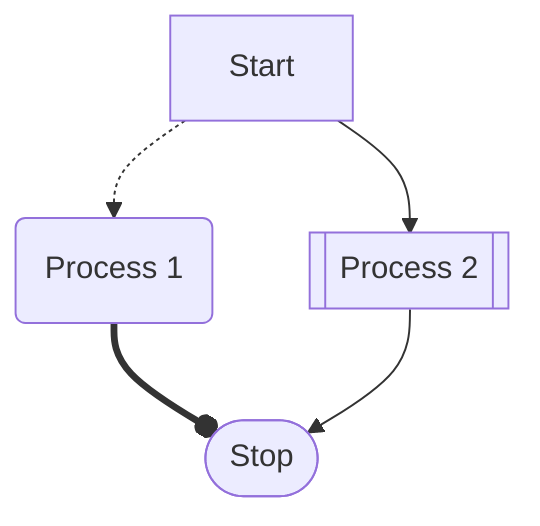
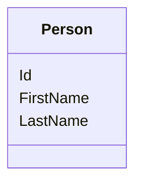

# trying mermaid

A quick demo of using Mermaid t oembed diagrams

## flowchart

```mermaid
graph TB
	A[Start] -.-> B(Process 1)
	A --> C[[Process 2]]
	B ==o D([Stop])
	C --> D
```

## class diagram

```mermaid
classDiagram
	class Person{
		Id
		FirstName
		LastName
	}
```